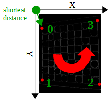

# CheckersRobot
This project has been realized as subsidiary formative activite (Lego Lab) for the Master Course in Computer Science at the University of Rome "La Sapienza".

The robot consists of four units:

1) Six-wheeled carriage FWD (two-wheel drive). The task of the unit is to move the robot along the edge of the board (X-axis)

2) Carrier. This unit places the arm of robot over chessboard (Y-axis).

3) Scissor lift. This unit lifts and lowers the robot arm.

4) Claw. Simply grabs the pawns. Unlike the other units which use large servo motors, this unit uses a medium motor.

The movements of the human player are captured by a webcam fixed on one of the free sides, the images are analyzed to detect which pieces have been moved and the result is sent to the draughts engine that will give the next move which will send to the EV3 by bluetooth.
The whole project is written in Java. The checkers engine implements the MiniMax algorithm with alpha-beta pruning and the quiescent search. The code that analyzes the images makes use of OpenCV library.

### Screenshot


### Video
https://www.youtube.com/watch?v=rRNOXEZBs28

### Picture
https://plus.google.com/photos/photo/104626533427419398246/6207104140331136786

### Design
https://plus.google.com/photos/104626533427419398246/album/6260873768281079857

### Building Instructions
https://drive.google.com/open?id=0B9II24hvksAKd0dfSUo4a0lXd2s


## Image Processing
### Capture image
```java
Mat mat = new Mat();                      // Image container
VideoCapture video = new VideoCapture();  //  C++ API
video.open(0);                            // Open default capturing device
video.read(mat);                          // Grab next video frame
video.release();                          // Release resources.
```


### ChessBoard detection

#### Preprocessing
Rotate the image by 90 degrees.
```java
Mat chessboard = new Mat();
Core.flip(mat.t(), chessboard, 0);
```


Transform the image from BGR to Grayscale format.
```java
Mat chessboardGrey = new Mat();
Imgproc.cvtColor(chessboard, chessboardGrey, Imgproc.COLOR_BGRA2GRAY);
```


Smooth the image with Gaussian Filter to remove noise.
```java
Imgproc.GaussianBlur(chessboardGrey, chessboardGrey, new Size(11, 11), 0);
```


Adaptive (illumination-independent) threshold. The result is a binary image with a white grid.
```java
Mat chessboardBin = new Mat();
Imgproc.adaptiveThreshold(chessboardGrey, chessboardBin, 255,Imgproc.ADAPTIVE_THRESH_MEAN_C,Imgproc.THRESH_BINARY, 5, 2);
```


#### Blob detection
Find all contours in the binary image.
```java
contours = new ArrayList<MatOfPoint>();
Imgproc.findContours(chessboardBin, contours, new Mat(), Imgproc.RETR_TREE, Imgproc.CHAIN_APPROX_SIMPLE);
```

Cycles through the contours, converting each one to a polygon. If the polygon has four corners, and is bigger than the previous biggest one, then save the four points.
```java
for (int i = 0; i < contours.size(); i++) {
	contour = contours.get(i);
	area = Imgproc.contourArea(contour);		
	approx = new MatOfPoint2f();
	curve = new MatOfPoint2f(contour.toArray());
	Imgproc.approxPolyDP(curve, approx, Imgproc.arcLength(curve, true) * 0.02, true);
	if (approx.total() == 4 && maxim < area) {
		maxim = area;
		points = approx.toList();
	}
}
```


#### Image warping
Sort four points in clockwise order.
```java
Collections.sort(points, new ClockWiseComparator(points));
```


Find the longest edge of the chessboard.
```java
ptTopLeft = points.get(0);
ptBottomLeft = points.get(1);
ptBottomRight = points.get(2);
ptTopRight = points.get(3);
maxArea = Math.max(
		Math.max(
			Math.pow((ptBottomLeft.x - ptBottomRight.x), 2) + Math.pow((ptBottomLeft.y - ptBottomRight.y), 2),
			Math.pow((ptTopRight.x - ptBottomRight.x), 2) + Math.pow((ptTopRight.y - ptBottomRight.y), 2)
			) 
		,Math.max(
			Math.pow((ptTopRight.x - ptTopLeft.x), 2) + Math.pow((ptTopRight.y - ptTopLeft.y), 2),
			Math.pow((ptBottomLeft.x - ptTopLeft.x), 2) + Math.pow((ptBottomLeft.y - ptTopLeft.y), 2)
			)
		);
```

Create a new square image.
```java
double side = Math.sqrt((double) maxArea);			// length of the longest edge
Mat warped = new Mat(new Size(side, side), CvType.CV_8UC1);	// new square image
```

Correct perspective of the chessboard.
```java
destinations = new ArrayList<Point>();
destinations.add(new Point(0, 0));
destinations.add(new Point(0, side - 1));
destinations.add(new Point(side - 1, side - 1));
destinations.add(new Point(side - 1, 0));
Imgproc.warpPerspective(chessboard, warped, Imgproc.getPerspectiveTransform(Converters.vector_Point2f_to_Mat(points),Converters.vector_Point2f_to_Mat(destinations)),new Size(side, side));
```


### Color calibration
#### Preprocessing
Cut the image in half.
```java
h = warped.height() / 2;
w = warped.width();
chessboardHalf = warped.submat(new Rect(0, white ? h : 0, w, h));
```


Transform the image from BGR to HSV color space.
```java
chessboardHSV = new Mat();
Imgproc.cvtColor(chessboardHalf, chessboardHSV, Imgproc.COLOR_BGR2HSV);
```


Transform the image from BGR to Grayscale format.
```java
Imgproc.cvtColor(chessboardHalf, chessboardGrey, Imgproc.COLOR_BGR2GRAY);
```


Smooth the grayscale image to remove noise.
```java
Imgproc.medianBlur(chessboardGrey, chessboardGrey, 5);
```


#### Color extraction
Finds circles in a grayscale image.
```java
circles = new Mat();
Imgproc.HoughCircles(chessboardGrey, circles, Imgproc.CV_HOUGH_GRADIENT, 2, chessboardGrey.height() / 4, 50, 30,25, 30);
```

For each circle, get the center point and radius; starting from the center, extract the color from the HSV space using 8 points (0° ,45° ,90° ,135° ,180° ,225° ,270° ,315° ) on different concentric circumferences. The colors are compared to determine the recognition range [min,max].
```java
for (int i = 0; i < circles.cols(); i++) {	
	data = circles.get(0, i);	
	cx = Math.round(data[0]);	
	cy = Math.round(data[1]);	
	radius = (int) Math.round(data[2]) – 2;
	
	for (int r = 0; r < radius * 2 / 3; r += 5) {
		for (int z = 0; z < 360; z += 45) {
			rad = Math.toRadians(z);
			x = cx + Math.cos(rad) * r;
			y = cy + Math.sin(rad) * r;
			hsv = chessboardHSV.get((int) y,(int) x);
			
			if (hsv == null)
				continue;
			
			for (int j = 0; j < 3; j++) {
				threshold = j == 0 ? 0 : 5;
				low = Math.max(hsv[j] - threshold, 0);
				upper = Math.min(hsv[j] + threshold, j == 0 ? 180 : 225);
				
				if (lowerHSV.val[j] > low)
					lowerHSV.val[j] = low;
				
				if (upperHSV.val[j] < upper)
					upperHSV.val[j] = upper;
			}
		}
	}
}
```


### Pawns detection
Detect obejcts based on HSV range values.
```java
chessboardPawns = new Mat();
Core.inRange(chessboardHSV, lower, upper, chessboardPawns);
```


Erosion + dilation to remove noise.
```java
Imgproc.morphologyEx(chessboardPawns, chessboardPawns, Imgproc.MORPH_OPEN, Imgproc.getStructuringElement(Imgproc.MORPH_RECT,new Size(5,5)));
```


Find the contours of the pawns.
```java
Imgproc.findContours(chessboardPawns, shapes, new Mat(), Imgproc.RETR_EXTERNAL, Imgproc.CHAIN_APPROX_SIMPLE, new Point(0, 0));
```

Cycles through the contours, converting each one to a polygon. If the area of the polygon is sufficiently large, get the center and determines the positions on the chessboard.
```java
pawns = new ArrayList<Pawn>();
size = chessboardPawns.size();
cellHeight = size.height / 8;
cellWidth = size.width / 8;

for (MatOfPoint shape : shapes) {
	area = Imgproc.contourArea(shape, false);

	if (area >= PAWN_AREA) {
		cell2f = new MatOfPoint2f();
		Imgproc.approxPolyDP(new MatOfPoint2f(shape.toArray()), cell2f, 2, true);
		rect = Imgproc.minAreaRect(cell2f);
		center = rect.center;
		i = (int) Math.floor(center.y / cellHeight);
		j = (int) Math.floor(center.x / cellWidth);
		pawns.add(new Pawn(i, j, white));
	}
}
```
